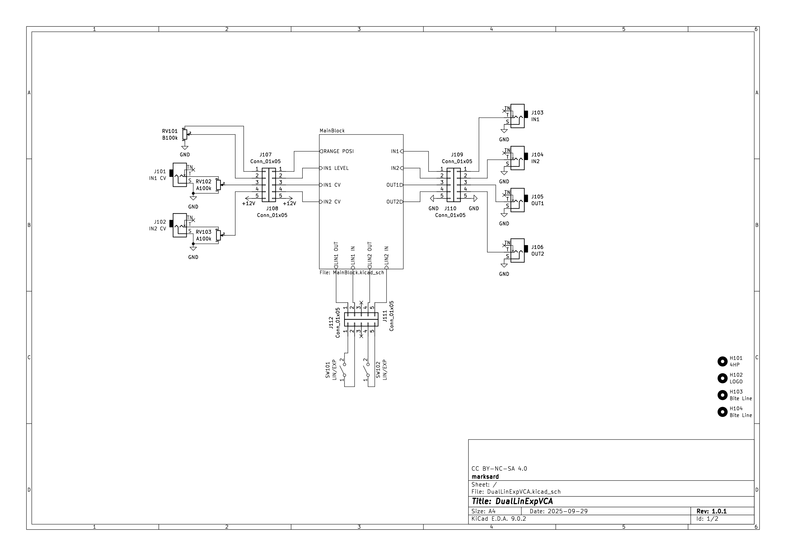
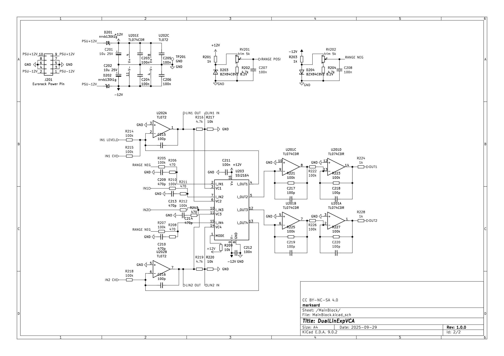

# Dual Lin/Exp VCA 操作マニュアル

## 目次

1. [はじめに](#1-はじめに)  
2. [ハードウェア概要](#2-ハードウェア概要)  
   - 2.1 [入出力端子](#21-入出力端子)  
   - 2.2 [操作子](#22-操作子)  
3. [電源接続と電源投入について](#3-電源接続と電源投入について)  
4. [トラブルシューティング](#4-トラブルシューティング)  
5. [仕様](#5-仕様)  
6. [付録](#6-付録)  
   - 6.1 [CVのユニティゲイン調整](#61-cvのユニティゲイン調整)  
   - 6.2 [IN1 LEVELポットのユニティゲイン調整](#62-in1-levelポットのユニティゲイン調整)  
   - 6.3 [回路図](#63-回路図)  
   - 6.4 [URL](#64-url)  
7. [免責事項](#7-免責事項)  
8. [改版履歴](#8-改版履歴)  

---

## 1-はじめに

Dual Lin/Exp VCAはSSI2164チップを搭載したVoltage Contolled Amplifierです。  
スリムな4HPサイズに2基の独立したVCAを備えています。  
コントロールの特性をリニア/指数に切り替えられるようになっていて、入力するエンベロープカーブの特性を鋭くすることが可能です。  

このマニュアルでは、Dual Lin/Exp VCAの基本的な使い方から各アルゴリズムの詳細、設定方法までを解説します。

---

## 2-ハードウェア概要

### 2.1-入出力端子

<ul>
<li><b>CV1,CV2</b></li>
  IN1のゲインをコントロールするCVを入力します。 
  CVポット全開時、5Vの入力でユニティゲイン※です。それ以上のCVを入力すると増幅されますので、適宜CVポットを調整してください。 
  負電圧側には反応しません。 
  （※初期設定。背面トリム調整による） 
<li><b>IN1,IN2</b></li>
  ゲインを可変したい信号を入力します。 
  DCカップリングのため、CVを入れることも可能です。 
<li><b>OUT1,OUT2</b></li>
  CVによるゲイン可変後の信号を出力します。 
</ul>

### 2.2-操作子

- **IN1 LEVEL**  
  IN1に対する出力レベルをCV入力によらず調整できます。  
  CVにバイポーラLFOを入れ、このレベル調整で正電圧側にオフセットすることでトレモロやAMなどの効果を得ることが出来ます。  

- **IN1 CV, IN2 CV**  
  CV1, CV2に入力した電圧の調整に使います。

- **Lin<>EXP**  
  CV入力に対する反応スケールを選択します。スイッチの先端が左にあるときはリニア特性、右にあるときは指数特性です。  
  SSI2164本来の指数特性ではなく、少し緩めの扱いやすい特性としています。  
  リニアタイプのEGを指数的に扱ったりすることはもちろん、指数タイプのEGをさらに鋭くしてプラッキーな音を得るなども可能です。  

- **CV MAX RANGEトリムポット**  
  CVのユニティゲイン調整で使用します。  

- **IN1 MAXトリムポット**  
  IN1 LEVELポットのユニティゲイン調整で使用します。  

---

## 3-電源接続と電源投入について

1. モジュールをユーロラックケースに取り付け、電源ケーブルを正しく接続してください。  
2. ケースの電源をONにすると、モジュールが起動します。  

モジュールの電源ピンの片側に-12Vの白線のシルクを印刷している側が-12Vのあるピンになります。  
正常なユーロラックシステムの電源とリボンケーブルの組み合わせであれば、リボンケーブルの赤いラインがあるほうに-12Vが流れていますので、赤いラインと-12Vのピンを接続してください。  

---

## 4-トラブルシューティング

使用中に問題が発生した場合は、以下の項目を参考に対処してください。  

### 4.1-電源が入らない
- ユーロラックケースの電源が正しく接続されているか確認してください。  
- 電源ケーブルの向きや接続ミスがないか確認してください（逆接続に注意）。  
- 他のモジュールで電源が正常に供給されているか確認してください。  
- ジャックのついた基板と、電源コネクタのついた基板がただしく接続されているか確認してください。  

### 4.2-出力されない
- 入力の元となるモジュールを確認してください。  
- CV入力の元となるモジュールを確認してください。  
- IN1なら、IN1 LEVELを上げて音が出るか確認してください。  
- CVが負電圧側でしか動作していない場合は出力されません。  

#### それでも解決しない場合
- 開発者（@marksard）にお問い合わせください。boothの購入された商品ページにある「ショップへのお問い合わせ」からお願いいたします。またXやBlueskyでもリプライいただければ対応いたします。  
- その際は不具合内容、再現方法などをできるだけ詳しく伝えてください。  

---

## 5-仕様

| 項目 | 内容 |
|---|---|
| 幅 | ユーロラック規格：4HP |
| 深さ | 300mm（パネル面から。電源コネクタ除く） |
| 電源 | ユーロラック規格 ±12V（2x5pin） |
| 消費電流 | +12V：19mA -12V：17mA |
| CV  | 2系統（CV1, CV2） 0～10V 入力インピーダンス：100kΩ |
| 入力 | 2系統（IN1, IN2） ±10V 入力インピーダンス：100kΩ |
| 出力 | 2系統（OUT1, OUT2） ±10V 出力インピーダンス：1kΩ |
| 操作子 | IN1レベル調整　～8V（トリマで調整可） CV1,CV2調整、リニア/指数カーブ切り替えスイッチ |

※出力電圧・出力電流、消費電流については出力へ接続した負荷により変動する場合があります。  

---

## 6-付録

### 6.1-CVのユニティゲイン調整

1. ユーロラック電源コネクタを取り付けます。  
2. 電源を入れます。  
3. IN2に信号を入れ、CV2にピークとしたい電圧を入れます。  
4. IN2とOUT2をオシロスコープや電圧計などで観測し、だいたい同じ値になるようにCV MAX RANGEトリムポットを調整します。  

（※完成品出荷時は約5Vに調整してあります）  
（※IN1側と共通で利用していますのでIN1側で調整の必要はありません。部品精度の誤差もありIN1とIN2で少し出力電圧値に差が出ることがあります）  

### 6.2-IN1 LEVELポットのユニティゲイン調整

1. ユーロラック電源コネクタを取り付けます。  
2. 電源を入れます。  
3. IN1に信号を入れ、IN1 LEVELを全開にします。  
4. IN2とOUT2をオシロスコープや電圧計などで観測し、IN1 LEVEL全開時のレベルをIN1 MAXトリムポットで調整します。  

（※完成品出荷時は全開時にユニティゲインとなるように調整しています）  

### 6.3-回路図

  

  

### 6.4-URL

[Github](https://github.com/marksard/DualLinExpVCA)  

---

## 7-免責事項

### 品質・動作保証について
本モジュールは十分な検証を行っておりますが、全ての環境において正常に動作することを保証するものではありません。  
本モジュールの使用によって発生したいかなる損害（直接的・間接的を問わず）について、開発者および販売者は責任を負いません。  

### 技術的サポートについて
本モジュールに関するサポートは可能な範囲で提供しますが、商業製品のような継続的なサポートや保証をお約束するものではありません。  
お問い合わせへの対応は任意で行われ、必ずしもすべての問題に対応できるとは限りません。  

### 安全性について
本モジュールは十分な注意をもって設計されていますが、使用環境や誤った取り扱いによって事故が発生する可能性があります。  
適切に注意を払い自己責任にてご使用ください。  

### 免責事項の変更について
必要に応じて免責事項を変更する場合があります。  

---

## 8-改版履歴
- 2025-09-29 初版  

<footer style="text-align:center; font-size:12px; margin-top:50px;">
Dual Lin/Exp VCA Operation Manual  © 2025 by marksard.
</footer>
